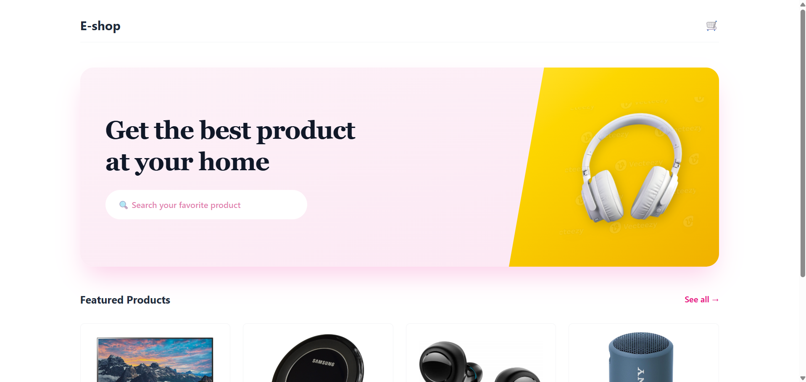
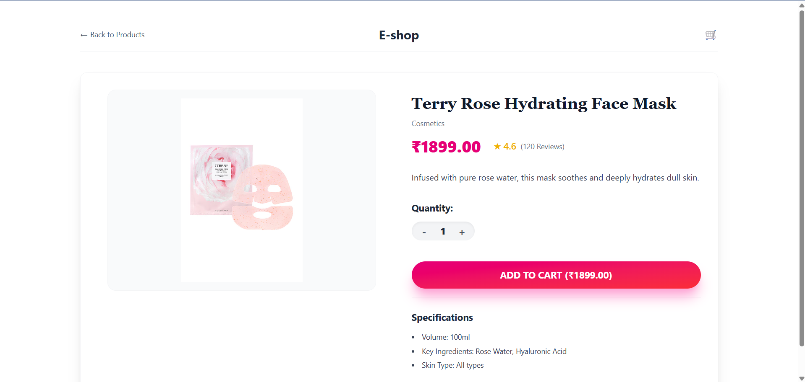
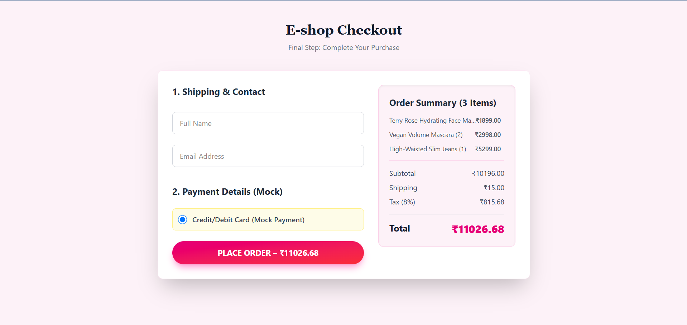

# Mock E-Com Cart: Full-Stack Shopping Application

This project is a complete, working full-stack shopping cart application built to fulfill the Vibe Commerce screening assignment requirements. It focuses on modern architectural principles, API design, data persistence, and a clean, responsive UI.

## Live Demo & Deliverables

| Deliverable | Status | Details |
| :--- | :--- | :--- |
| **Tech Stack Compliance** | Complete | React, Node/Express, MongoDB Atlas. |
| **Full API Coverage** | Complete | All 5 transactional APIs are implemented and fully integrated. |
| **DB Persistence** | Complete | User sessions and Cart state are persistently stored in MongoDB Atlas. |
| **Responsive Design** | Complete | Implemented using Tailwind CSS. |

---

## Tech Stack & Architecture

| Component | Technology | Role in Project |
| :--- | :--- | :--- |
| **Frontend (UI)** | **React (Vite)** | SPA framework using functional components and hooks. |
| **Styling** | **Tailwind CSS** | Utility-first framework for a clean, modern, and responsive design (Pink/Yellow theme). |
| **API Client** | **Axios** | Centralized, promise-based API communication (in `apiService.js`). |
| **Backend (Server)** | **Node.js & Express** | RESTful API creation and routing. |
| **Database** | **MongoDB Atlas** | Persistent cloud storage for users, products, and cart data. |
| **Security** | **Bcryptjs** | Used for secure password hashing for user registration. |

---

## Installation and Setup Guide

### Prerequisites

1.  Node.js (LTS version)
2.  A running instance of **MongoDB Atlas** (with a whitelisted IP).

### 1. Backend Setup (`/backend`)

1.  **Navigate and Install Dependencies:**
    ```bash
    cd backend
    npm install
    ```

2.  **Configure Environment:** Create a file named **`.env`** in the `/backend` directory and add your Atlas connection string.

    ```
    # .env
    MONGO_URI="mongodb+srv://[YOUR_USERNAME]:[YOUR_PASSWORD]@[CLUSTER_ADDRESS]/vibe_commerce_db?retryWrites=true&w=majority"
    ```

3.  **Seed the Database (CRITICAL STEP):**
    * Use Postman/Insomnia to send **POST requests** to `http://localhost:3000/api/products` for **8-10 items**. This populates the `products` collection with data required by the frontend.

4.  **Start the server:**
    ```bash
    npm start 
    # Server runs on http://localhost:3000
    ```

### 2. Frontend Setup (`/frontend`)

1.  **Navigate and Install Dependencies:**
    ```bash
    cd frontend
    npm install
    ```

2.  **Start the client:**
    ```bash
    npm run dev
    # Client typically runs on http://localhost:5173
    ```

---

## Application Screenshots (SS)

Please ensure your screenshots are saved in the `./screenshots/` directory of this repo.

### A. Home Page


### B. Product Image View!
[Screenshot of the cart page showing item list, totals, and checkout button](./screenshots/productsPage.png)


### B. Cart View


### C. Checkout and Receipt
